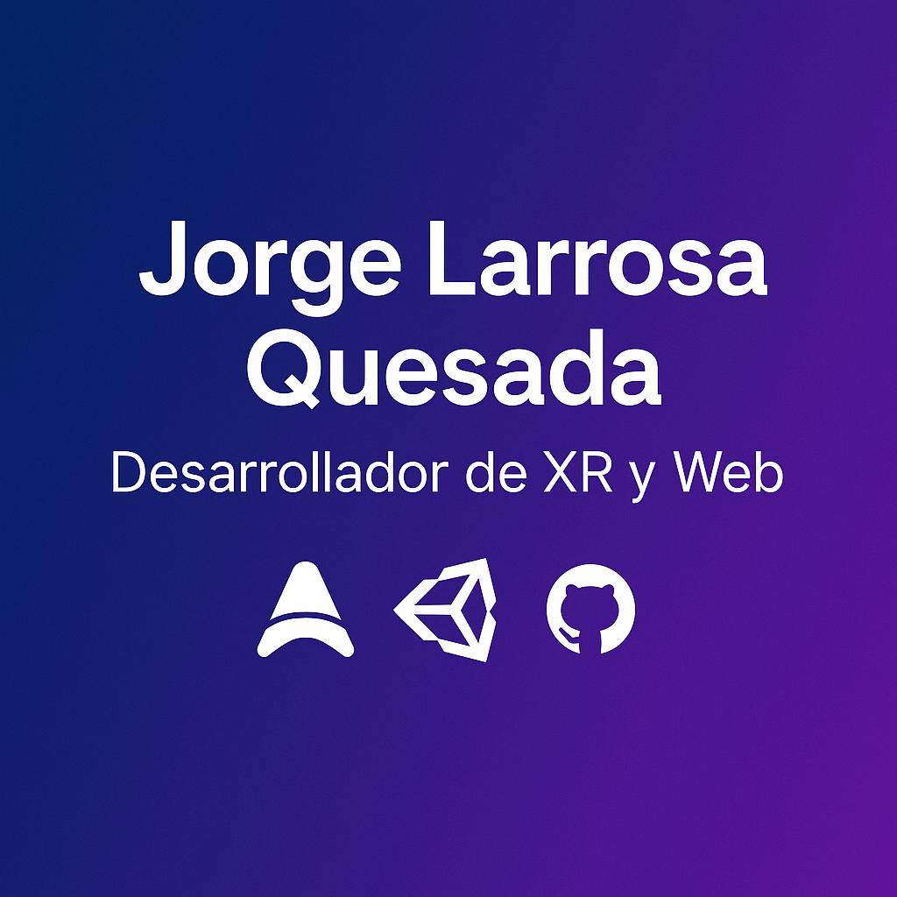

# 🌐 Portfolio de Jorge Larrosa Quesada

## 👋 **Sobre mí**

Soy **Jorge Larrosa Quesada**, desarrollador especializado en **Realidad Extendida (XR)**, con enfoque en **Realidad Mixta y Virtual**, y experiencia en **desarrollo web moderno**.  

Actualmente trabajo en la **Universitat Internacional de Catalunya**, donde aplico la tecnología para crear experiencias interactivas e innovadoras. Cuento con más de **2 años de experiencia profesional** en el sector tecnológico 🚀.  

Este portfolio ha sido desarrollado con **[Astro](https://astro.build/)** y **TailwindCSS**, y está desplegado en **[Vercel](https://vercel.com/)**.

---

## ✨ **Tecnologías utilizadas**

- ⚡ **Astro** — Framework ultrarrápido para sitios estáticos y componentes modernos.  
- 🎨 **TailwindCSS** — Estilos elegantes, personalizables y totalmente responsivos.  
- 🧑‍💻 **TypeScript** — Tipado estático y desarrollo más seguro.  
- 🖼️ **Astro Content Collections** — Gestión estructurada de proyectos y experiencias.  
- 📹 **YouTube Lite Embed** — Integración optimizada de vídeos para mejorar el rendimiento.  
- ☁️ **Vercel** — Plataforma de hosting y despliegue continuo (CI/CD).  

---

## 🧭 **Objetivo**

Este portfolio refleja mi **trayectoria**, mis **proyectos** y mi **pasión por unir tecnología y creatividad** para construir experiencias inmersivas, útiles y visualmente atractivas.  

---

## 📬 **Contacto**

- 💼 [LinkedIn](https://www.linkedin.com/in/jorgelarrosaquesada/)  
- 🌐 [Web Personal](https://www.jorgelq.com)  
- ✉️ **jorgelarrosaquesada@gmail.com**

---

